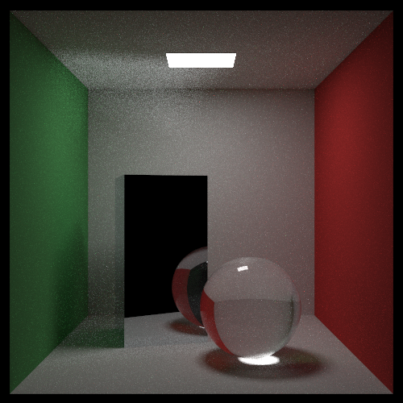

# Raytracing-Test
Following "Raytracing In One Weekend" and subsequent books to learn about raytracing.  
These books are found at: https://raytracing.github.io/

# Building
You can build on windows, no strings attached.  
Everything should be set up as it is (If there's a problem please create an issue haha)  
just go ahead and build :^)  

# Outputting a file
To output a file, you will need to build the file,  
Then open command prompt to path to the file,  
Then run: `.\"Raytracing Test.exe > image.ppm"`  
Then open the ppm file, my preferred website is [this one.](https://www.cs.rhodes.edu/welshc/COMP141_F16/ppmReader.html)

# Output:
